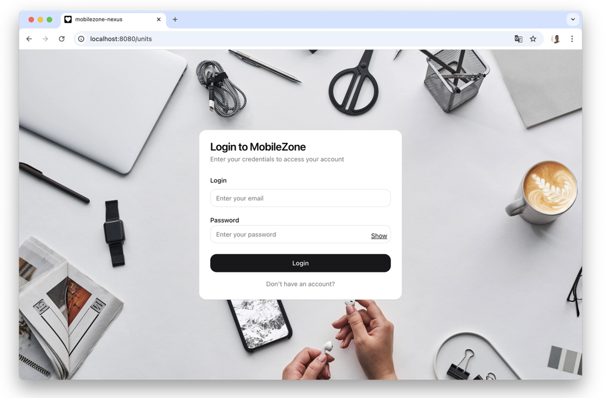
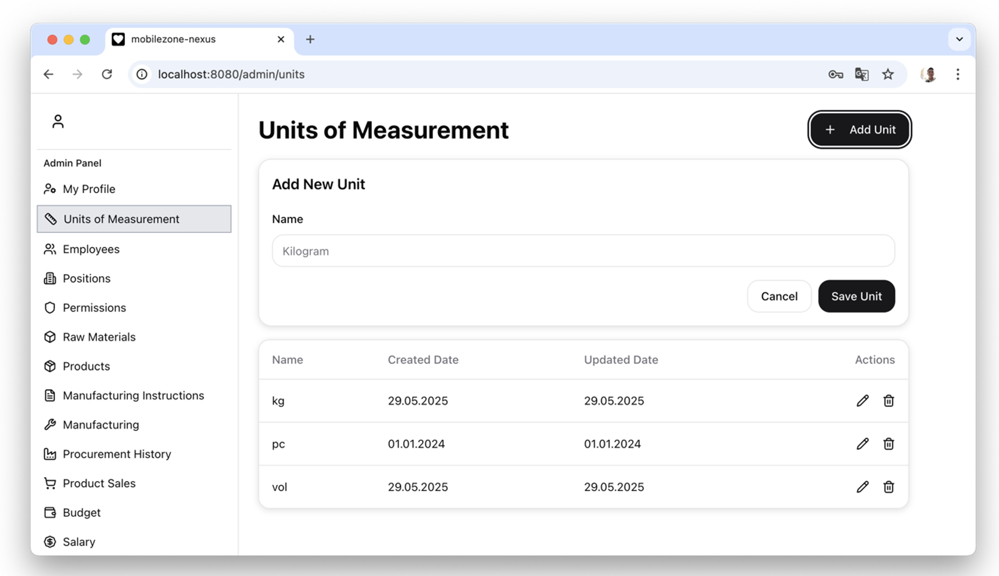
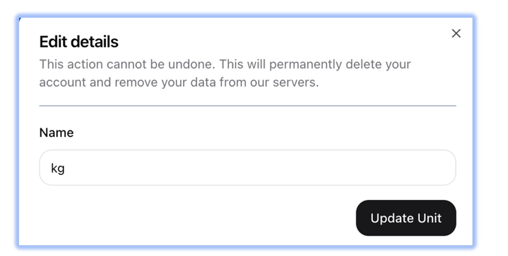
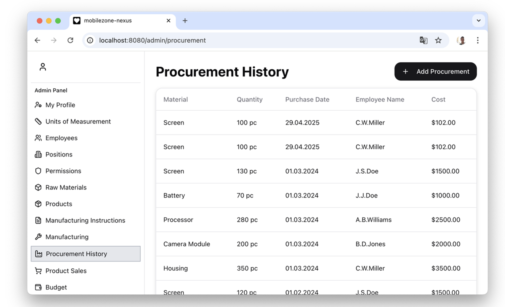
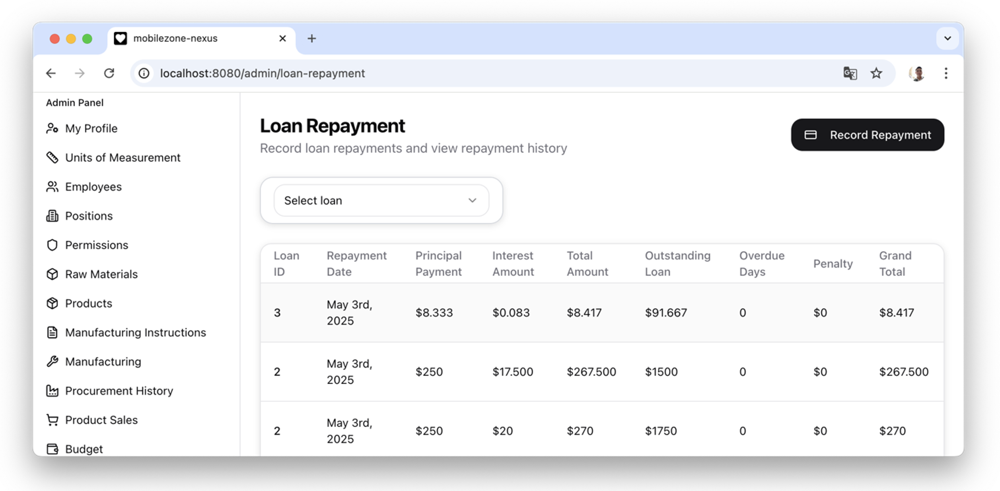
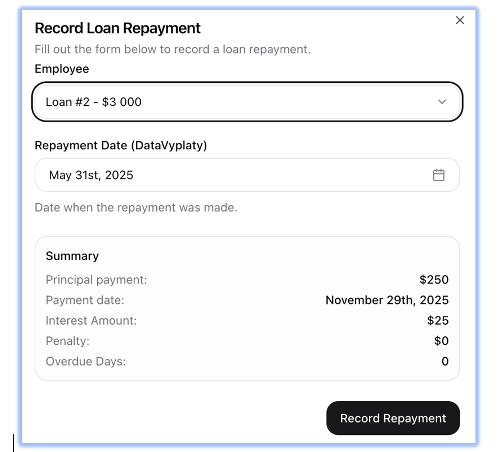
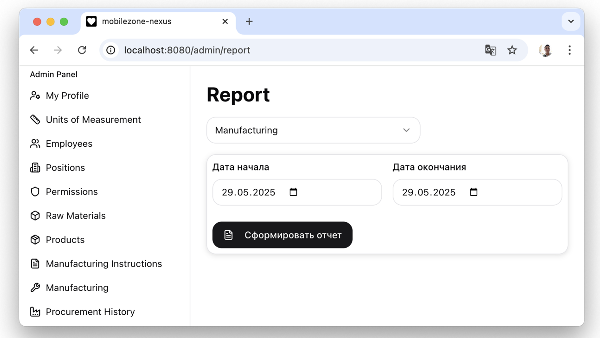
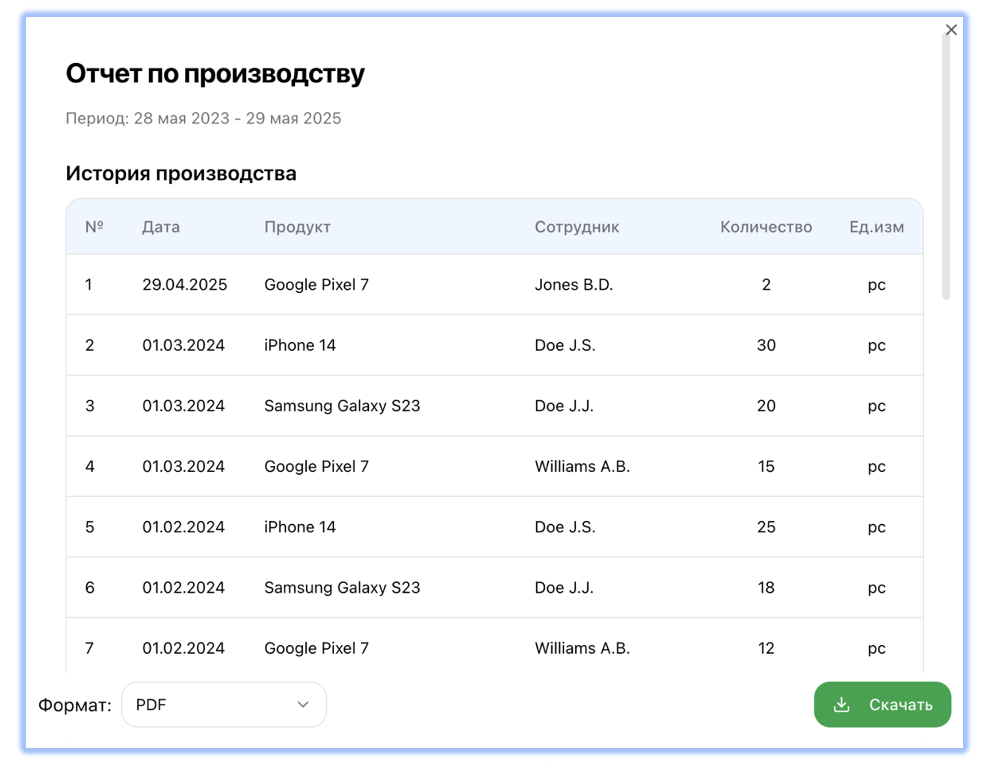
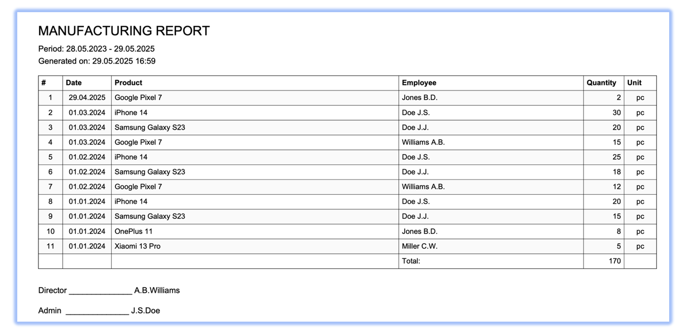

# 📱 MobileZone – Web Application for Managing a Mobile Phone Manufacturing Company

## 📌 1. Introduction

**MobileZone** is a modern web application designed to automate the management of a company engaged in the production and sale of mobile phones. The system covers the entire business cycle: from raw material procurement to payroll calculation and credit management.

The project provides:
- transparent business processes,
- increased accuracy in data tracking,
- automation of routine operations,
- generation of analytical reports for decision-making.

  

---

## ⚙️ 2. Technologies Used

### 🧩 Backend:
- **Node.js** + **Express**
- **TypeScript**
- **Sequelize** ORM
- **Microsoft SQL Server** (via `tedious`)

### 🎨 Frontend:
- **React** + **TypeScript** + **Vite**
- **Tailwind CSS**
- **Shadcn/UI** (based on Radix UI)

### 📦 Additional Libraries:
- Authentication: `jsonwebtoken`, `bcrypt`
- PDF/Excel Reports: `jspdf`, `html2canvas`, `xlsx`
- State Management: `mobx`
- Validation: `class-validator`, `zod`
- UI Enhancements: `lucide-react`, `react-icons`, `embla-carousel-react`

---

## 🛠 3. Features

**MobileZone** provides full control over the business processes of a mobile phone manufacturing company:

### 📏 Units of Measurement
- Create, update, and delete measurement units (pcs, kg, liters, etc.)

### 👨‍💼 Employees & Positions
- Manage employees: add, update, delete
- Manage positions: add, update, delete
- Assign granular permissions per position (dynamic access system)

### ⚙️ Production Data
- Manage raw materials: add, update, delete
- Manage products (phones): add, update, delete
- Production instruction: define material composition for each product
- Manufacturing products with automatic raw material deduction and cost calculation

### 📦 Procurement & Sales
- Record raw material purchases (with cost and employee)
- Record product sales (with revenue calculation)

### 💰 Budget & Financial Management
- View and modify the company budget
- Configure:
  - Product markup percentage
  - Employee bonus percentage
  - Sale-related commissions
- Track income/expense history

### 🧾 Payroll
- Calculate salaries for any given month based on:
  - Number of sales
  - Production output
  - Raw material purchases
- Automatic bonus distribution
- Salary issuance with payment status tracking

### 🏦 Credit Management
- Take out company loans with:
  - Loan amount, interest rate, duration, penalty
- Make credit payments:
  - Principal, interest, and penalties
  - Track remaining debt

### 📑 Report Generation
- Generate **PDF** (and other formats) reports for:
  - Purchases
  - Production
  - Sales
  - Salaries
  - Loans

---

## 🖼 4. Screenshots

### 🔐 Login Page

### 📏 Measurement Units

### 📦 Ingredient Management

### 👨‍💼 Positions & Permissions

### 💰 Purchases & Loans

### 📑 Report Generation

